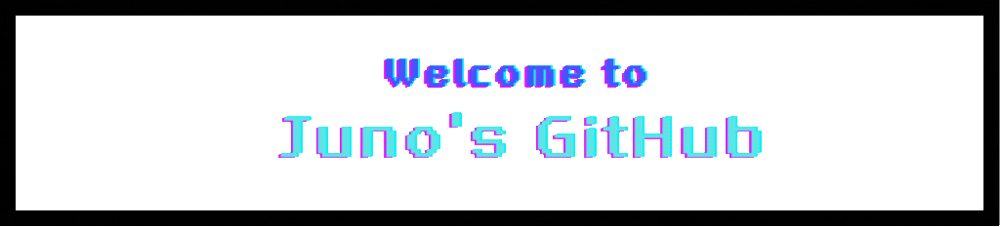

  

---

<h3 align="center">About me</h3>

  <!--블로그-->
  
  &nbsp
  
  &nbsp
  
  &nbsp
  
  &nbsp
  
  <h4>📍Education </h4>
   - Korea National Open University Department of Statistics and Data Science (Expected Graduate : ( - 02/2026)
    
   
   
  
  <h4>📍Organizations </h4>
  - Kakao Tech BootCamp (카카오테크 부트캠프) : AI 과정 (9/2025) 
   
  - B.D.A (빅데이터 분석 학회) : 학회원 / 전국 대학생 연합 빅데이터 학회 (9/2025 ~ ) 
   
  - ABC BootCamp (ABC 부트캠프) : Data 과정 (7/2025 - 8/2025) 
   
  - KNOU Regression-model Club (대학교 회귀모형 스터디 동아리) : Presenter(발표자) (3/2025 - 7/2025) 
<!--   
  <h4>📍Awards</h4>
   - 2024 세종시 농협 장학생 
   
   - 2025 Awards for Excellent ABC Program Essays
   
  

  <h4>📍experiences</h4>
  - 2025 카카오 개발자 컨퍼런스 ( if(kakao)25 ) : Attendees
    
  

 
<h4>📍Qualifications </h4>
- ADSP (11/2024)
 
- 정보처리기사(필기 합격(09/2025), 실기 공부 중(11/2025))
 
  
<!--내용 부분-->
<h3 align="center">🪐 Studying 🪐</h3>

  <!--python/html/css/gcp/ swift/swiftui-->

 
&nbsp
  
  &nbsp
  
  &nbsp
  
  &nbsp
  
  &nbsp

  <!-- git/ github / vscode / 노션 / 피그마 -->

   
  
  &nbsp
  
  &nbsp
    
    &nbsp

  
  &nbsp
  
  &nbsp

<h3 align="center">🪐 Interested 🪐</h3>

  <!--리액트/타입스크립트/sql-->
  
  &nbsp
  
  &nbsp
  
  &nbsp
  

<h4>📍languages </h4>
  - OPIc : IH(를 따기 위한 노력 중에 있음.)
